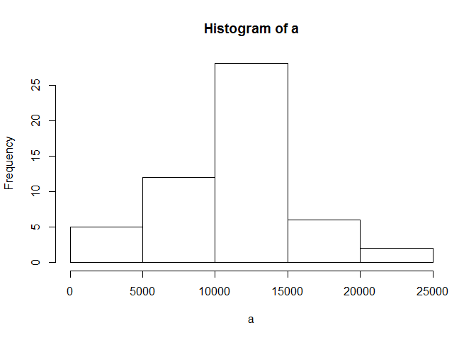
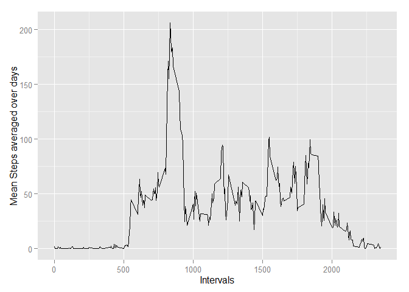
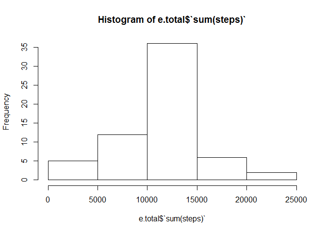
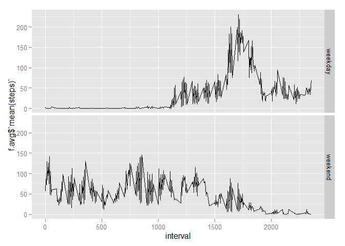

# Reproducible Research: Peer Assessment 1

## Loading and preprocessing the data

```r
library(ggplot2)

#Set working directory
setwd("C:/Users/Ken/Google Drive/Coursera - Data Science - 5-Reproducible Research/Assignment 1")

#Read in file
file <- read.csv("./activity.csv", header = TRUE)

#Convert "date" variable to date format
file$date <- as.Date(file$date, "%Y-%m-%d")
```


## What is mean total number of steps taken per day?


```r
#Group data across intervals by date
a <- by(file$steps, file$date, sum)

#Calculate total number steps taken per day
a
```

```
## file$date: 2012-10-01
## [1] NA
## -------------------------------------------------------- 
## file$date: 2012-10-02
## [1] 126
## -------------------------------------------------------- 
## file$date: 2012-10-03
## [1] 11352
## -------------------------------------------------------- 
## file$date: 2012-10-04
## [1] 12116
## -------------------------------------------------------- 
## file$date: 2012-10-05
## [1] 13294
## -------------------------------------------------------- 
## file$date: 2012-10-06
## [1] 15420
## -------------------------------------------------------- 
## file$date: 2012-10-07
## [1] 11015
## -------------------------------------------------------- 
## file$date: 2012-10-08
## [1] NA
## -------------------------------------------------------- 
## file$date: 2012-10-09
## [1] 12811
## -------------------------------------------------------- 
## file$date: 2012-10-10
## [1] 9900
## -------------------------------------------------------- 
## file$date: 2012-10-11
## [1] 10304
## -------------------------------------------------------- 
## file$date: 2012-10-12
## [1] 17382
## -------------------------------------------------------- 
## file$date: 2012-10-13
## [1] 12426
## -------------------------------------------------------- 
## file$date: 2012-10-14
## [1] 15098
## -------------------------------------------------------- 
## file$date: 2012-10-15
## [1] 10139
## -------------------------------------------------------- 
## file$date: 2012-10-16
## [1] 15084
## -------------------------------------------------------- 
## file$date: 2012-10-17
## [1] 13452
## -------------------------------------------------------- 
## file$date: 2012-10-18
## [1] 10056
## -------------------------------------------------------- 
## file$date: 2012-10-19
## [1] 11829
## -------------------------------------------------------- 
## file$date: 2012-10-20
## [1] 10395
## -------------------------------------------------------- 
## file$date: 2012-10-21
## [1] 8821
## -------------------------------------------------------- 
## file$date: 2012-10-22
## [1] 13460
## -------------------------------------------------------- 
## file$date: 2012-10-23
## [1] 8918
## -------------------------------------------------------- 
## file$date: 2012-10-24
## [1] 8355
## -------------------------------------------------------- 
## file$date: 2012-10-25
## [1] 2492
## -------------------------------------------------------- 
## file$date: 2012-10-26
## [1] 6778
## -------------------------------------------------------- 
## file$date: 2012-10-27
## [1] 10119
## -------------------------------------------------------- 
## file$date: 2012-10-28
## [1] 11458
## -------------------------------------------------------- 
## file$date: 2012-10-29
## [1] 5018
## -------------------------------------------------------- 
## file$date: 2012-10-30
## [1] 9819
## -------------------------------------------------------- 
## file$date: 2012-10-31
## [1] 15414
## -------------------------------------------------------- 
## file$date: 2012-11-01
## [1] NA
## -------------------------------------------------------- 
## file$date: 2012-11-02
## [1] 10600
## -------------------------------------------------------- 
## file$date: 2012-11-03
## [1] 10571
## -------------------------------------------------------- 
## file$date: 2012-11-04
## [1] NA
## -------------------------------------------------------- 
## file$date: 2012-11-05
## [1] 10439
## -------------------------------------------------------- 
## file$date: 2012-11-06
## [1] 8334
## -------------------------------------------------------- 
## file$date: 2012-11-07
## [1] 12883
## -------------------------------------------------------- 
## file$date: 2012-11-08
## [1] 3219
## -------------------------------------------------------- 
## file$date: 2012-11-09
## [1] NA
## -------------------------------------------------------- 
## file$date: 2012-11-10
## [1] NA
## -------------------------------------------------------- 
## file$date: 2012-11-11
## [1] 12608
## -------------------------------------------------------- 
## file$date: 2012-11-12
## [1] 10765
## -------------------------------------------------------- 
## file$date: 2012-11-13
## [1] 7336
## -------------------------------------------------------- 
## file$date: 2012-11-14
## [1] NA
## -------------------------------------------------------- 
## file$date: 2012-11-15
## [1] 41
## -------------------------------------------------------- 
## file$date: 2012-11-16
## [1] 5441
## -------------------------------------------------------- 
## file$date: 2012-11-17
## [1] 14339
## -------------------------------------------------------- 
## file$date: 2012-11-18
## [1] 15110
## -------------------------------------------------------- 
## file$date: 2012-11-19
## [1] 8841
## -------------------------------------------------------- 
## file$date: 2012-11-20
## [1] 4472
## -------------------------------------------------------- 
## file$date: 2012-11-21
## [1] 12787
## -------------------------------------------------------- 
## file$date: 2012-11-22
## [1] 20427
## -------------------------------------------------------- 
## file$date: 2012-11-23
## [1] 21194
## -------------------------------------------------------- 
## file$date: 2012-11-24
## [1] 14478
## -------------------------------------------------------- 
## file$date: 2012-11-25
## [1] 11834
## -------------------------------------------------------- 
## file$date: 2012-11-26
## [1] 11162
## -------------------------------------------------------- 
## file$date: 2012-11-27
## [1] 13646
## -------------------------------------------------------- 
## file$date: 2012-11-28
## [1] 10183
## -------------------------------------------------------- 
## file$date: 2012-11-29
## [1] 7047
## -------------------------------------------------------- 
## file$date: 2012-11-30
## [1] NA
```

```r
#Histogram of total number of steps taken each day
hist(a)
```

 

```r
#Calculate/report mean and median of the total number of steps taken per day
a.mean <- mean(a, na.rm = TRUE)
a.median <- median(a, na.rm=TRUE)

paste("The mean equals", a.mean)
```

```
## [1] "The mean equals 10766.1886792453"
```

```r
paste("The median equals", a.median)
```

```
## [1] "The median equals 10765"
```

## What is the average daily activity pattern?


```r
library(dplyr)
```

```
## 
## Attaching package: 'dplyr'
## 
## The following objects are masked from 'package:stats':
## 
##     filter, lag
## 
## The following objects are masked from 'package:base':
## 
##     intersect, setdiff, setequal, union
```

```r
#Group original file by intervals and average steps overal all days for each interval
b <- group_by(file, interval)
b.avg <- summarize(b, mean(steps, na.rm=TRUE))

# Make a time series plot (i.e. type = "l") of the 5-minute interval (x-axis) and the average number of steps taken, averaged across all days (y-axis)
qplot(b.avg$interval, b.avg$`mean(steps, na.rm = TRUE)`, geom="line", xlab = "Intervals", ylab="Mean Steps averaged over days")
```

 

```r
# Which 5-minute interval, on average across all the days in the dataset, contains the maximum number of steps?
b.avg.max <- b.avg$interval[which.max(b.avg$`mean(steps, na.rm = TRUE)`)]
b.avg.max
```

```
## [1] 835
```

## Imputing missing values


```r
# Calculate and report the total number of missing values in the dataset (i.e. the total number of rows with NAs)
c <- file[is.na(file$steps),]
nrow(c)
```

```
## [1] 2304
```

```r
# Filling in all of the missing values in the dataset with the mean for that 5-minute interval.
d <- merge(c, b.avg, by.x = "interval", by.y = "interval")
d$steps <- d$`mean(steps, na.rm = TRUE)`

# Create a new dataset that is equal to the original dataset but with the missing data filled in.
e <- merge(file, d, by.x = c("date", "interval"), by.y = c("date", "interval"), all.x = TRUE)
e$steps <- ifelse(is.na(e$steps.x), e$steps.y, e$steps.x)
e <- e[, c("date", "interval", "steps")]

# Make a histogram of the total number of steps taken each day and Calculate and report the mean and median total number of steps taken per day. 
e <- group_by(e, date)
e.total <- summarize(e, sum(steps))
hist(e.total$`sum(steps)`)
```

 

```r
e.mean <- mean(e.total$`sum(steps)`)
e.median <- median(e.total$`sum(steps)`)

paste("The mean equals", e.mean)
```

```
## [1] "The mean equals 10766.1886792453"
```

```r
paste("The median equals", e.median)
```

```
## [1] "The median equals 10766.1886792453"
```

```r
# Do these values differ from the estimates from the first part of the assignment? 

paste("The difference in means between this latest data set and the one from the first part is", e.mean - a.mean)
```

```
## [1] "The difference in means between this latest data set and the one from the first part is 0"
```

```r
paste("The difference in medians between this latest data set and the one from the first part is", e.median - a.median)
```

```
## [1] "The difference in medians between this latest data set and the one from the first part is 1.1886792452824"
```

```r
# What is the impact of imputing missing data on the estimates of the total daily number of steps?
# Essentially, the impact of imputing missing data using the mean steps for each interval is to have no impact on the mean total steps but to slightly shift the median of the total steps values upward.
```

## Are there differences in activity patterns between weekdays and weekends?


```r
# Create a new factor variable in the dataset with two levels - "weekday" and "weekend" indicating whether a given date is a weekday or weekend day.
f <- e
f$day <- ifelse(weekdays(f$date) == "Saturday" | weekdays(f$date) == "Sunday", "weekend", "weekday")
f <- group_by(f, interval, day)
f.avg <- summarize(f, mean(steps))
f <- merge(f, f.avg, by.x = "interval", by.y = "interval", all.x = TRUE)

# Make a panel plot containing a time series plot (i.e. type = "l") of the 5-minute interval (x-axis) and the average number of steps taken, averaged across all weekday days or weekend days (y-axis).
qplot(interval, f.avg$`mean(steps)`, data = f.avg, facets = day ~ ., geom = "line")
```

 

